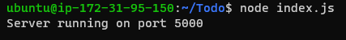
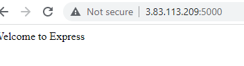
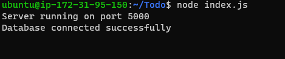

# Project3 Documentation

`sudo apt update`

`sudo apt upgrade`

`curl -fsSL https://deb.nodesource.com/setup_18.x | sudo -E bash -`

`sudo apt-get install -y nodejs`

`mkdir Todo`

`cd Todo`

`npm init`

`npm install express`

`touch index.js`

`npm install dotenv`

`vim index.js`

`http://http://3.83.113.209:5000/`

`mkdir routes`

`cd routes`

`touch api.js`

`vim api.js`

`cd Todo`

`npm install mongoose`

`mkdir models`

`cd models`

`touch todo.js`

`vim todo.js`

`cd routes`

`vim api.js`

`cd Todo`

`touch .env`

`vi .env`

`vim index.js`

`node index.js `

