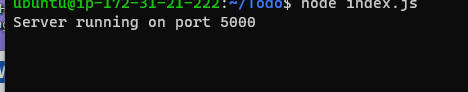

# Awesome Documentation of Project3
`sudo apt update`

`sudo apt upgrade`

`sudo apt-get install -y nodejs`

`mkdir Todo`

`cd Todo`

`npm init`

`npm install express`

`touch index.js`

`npm install dotenv`

`vim index.js`

`node index.js`

`http://http://3.93.200.138:5000`

`mkdir routes`

`cd routes`

`touch api.js`

`vim api.js`

`cd Todo`

`npm install mongoose`

`mkdir models`

`cd models`

`touch todo.js`

`vim todo.js `

`cd routes`

`vim api.js`

`cd Todo`

`touch .env`

`vi .env`

`vim index.js`

`node index.js`

`cd Todo`

`npx create-react-app client`

`npm install concurrently --save-dev`

`npm install nodemon --save-dev`

`vi package.json`

`cd client`

`vi package.json`

`http://http://3.93.200.138:3000 `

`cd Todo`

`cd client`

`cd src`

`mkdir components`

`touch Input.js ListTodo.js Todo.js`

`vi Input.js`

`cd clients`

`npm install axios`

`cd src/components`

`vi ListTodo.js`

`vi Todo.js`

`cd src`

`vi App.js`

`vi App.css`

`vi index.css`

`cd Todo`

